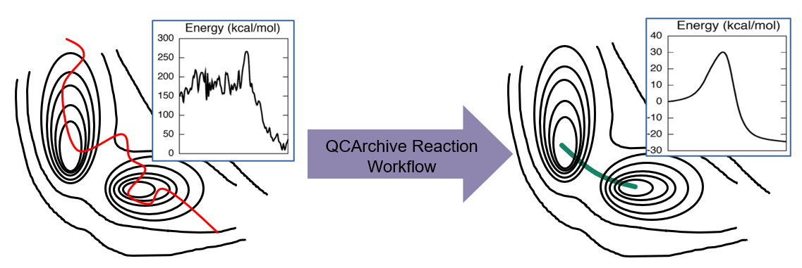

QCArchive Reaction Workflow (QCARWorkflow) can process molecular dynamic (MD) simulation trajectories and generate optimized reactants, products, and transition state structures.[1] It employs QCArchive Infrastructure to achieve efficient data storage and computing resource distribution.[2] QCARWorkflow can communicate with geomeTRIC[3] and Psi4[4] to refine MD simulation trajectories. The workflow is consist of four main functions, `dsoptimize`, `smoothing`, `neb`, and `optimize`. The first function `dsoptimize` locates minima on potential energy surfaces (PES) by optimizing molecular geometries of evenly sampled initial MD trajectories. `smoothing` function will detect potential reaction pathways from the result of `dsoptimize` and smooth them to provide good initial inputs for the nudged elastic band (NEB) method.[5] `neb` performs the NEB method to locate a rough transition state (TS) structure. The `optimize` function then optimizes the gussed TS structures (NEB results) to locate the first order saddle points. The next step is the Intrinsic Reaction Coordinate method starting with the optimized TS structure to confirm its validity.[6] Finally, two end points of the IRC (reactant and product) will be optimized.    

[1] Wang, L.-P.; McGibbon, R. T.; Pande, V. S.; Martinez, T.J. Automated Discovery and Refinement of Reactive Molecular Dynamics Pathways. *J. Chem. Theory Comput.* **2016**, 12(2), 638–649.[https://pubs.acs.org/doi/abs/10.1021/acs.jctc.5b00830](https://pubs.acs.org/doi/abs/10.1021/acs.jctc.5b00830) 
[2] Smith, D. G. A.; Altarawy, D.; Burns, L. A.; Welborn, M.;Naden, L. N.; Ward, L.; Ellis, S.; Pritchard, B. P.; Crawford,T. D. The MOLSSI QCARCHIVE Project: An Open‐source Platform to Compute, Organize, and Share Quantum Chemistry Data. *WIREs Comput. Mol. Sci.* **2020**.[https://doi.org/10.1002/wcms.1491](https://doi.org/10.1002/wcms.1491)   
[3] Wang, L.-P.; Song, C. Geometry Optimization Made Simple with Translation and Rotation Coordinates. *J. Chem. Phys.* **2016**, 144 (21), 214108.[https://doi.org/10.1063/1.4952956](https://doi.org/10.1063/1.4952956)  
[4] Turney, J.M.; Simmonett, A.C.; Parrish, R.M.; Hohenstein, E.G.; Evangelista, F.A.; Fermann, J.T.; Mintz, B.J.; Burns, L.A.; Wilke, J.J.; Abrams, M.L.; Russ, N.J.; Leininger, M.L.; Janssen, C.L.; Seidl, E.T.; Allen, W.D.; Schaefer, H.F.; King, R.A.; Valeev, E.F.; Sherrill, C.D.; Crawford, T.D. Psi4: an open‐source ab initio electronic structure program. *WIREs Comput. Mol. Sci.* **2012** 2: 556-565.[https://doi.org/10.1002/wcms.93](https://doi.org/10.1002/wcms.93)
[5] Henkelman, G.; Uberuaga B.P.; Jonsson H. A climbing image nudged elastic band method for finding saddle points and minimum energy paths. *J. Chem. Phys.* **2000**, 113 (22).[https://doi.org/10.1063/1.1329672](https://doi.org/10.1063/1.1329672)
[6] Gonzalez, C.; Schlegel H. B. An improved algorithm for reaction path following. *J. Chem. Phys.* **1989**, 90 (4), 2154-2161.[https://doi.org/10.1063/1.456010](https://doi.org/10.1063/1.456010) 

Author: Heejune Park

Contact Email: heepark@ucdavis.edu

## Quick Set Up
### 1. Creating a conda environment with dependencies

Commands below will create a conda environment with dependencies named qcarw.
 ```shell
conda update conda
conda env create -f environment.yml
conda activate qcarw
```
or
```shell
conda update conda
conda config --add channel conda-forge
conda config --add channel psi4/label/dev
conda create --name qcarw --file requirements.txt
conda activate qcarw
```
Now we need to install geomeTRIC and QCARWorkflow.

### 2. Installing geomeTRIC

Install geomeTRIC from the `neb` branch of a forked github repository:
[https://github.com/hjnpark/geomeTRIC/tree/neb](https://github.com/hjnpark/geomeTRIC/tree/neb)

The following command will clone the specific branch.
```shell
git clone -b neb git@github.com:hjnpark/geomeTRIC.git
```
This branch of geomeTRIC can perform the NEB and IRC method.
It will be merged into the master branch in the future.

### 3. Installing QCARWorkflow

QCARWorkflow can be installed in the conda environment now.
```shell
python setup.py install
```
Done!

## User Guide
### 1. Setting up a QCFractal server 

QCFractal server handles data storage and job submissions.
```shell
qcfractal-server init
```
The command above will create a server. Next, we can add users to the server. 
```shell
qcfractal-server user add User1 --password 1234 --permissions admin
``` 
`User1` is the ID and `1234` is the password.

`--permissions` is user permissions for `qcfractal-server`. `admin` allows all possible permissions (read, write, compute, and queue).
More details can be found [here](http://docs.qcarchive.molssi.org/projects/QCFractal/en/stable/server_user.html). 

Now running the command below will start the server.
```shell
qcfractal-server start
```

Once the server is running, [`qcfractal-manager`](http://docs.qcarchive.molssi.org/projects/QCFractal/en/stable/managers.html) needs to be submitted to computing resources. 

```shell
qcfractal-manager --fractal-uri=https://localhost:7777/  --verify False -u User1 -p 1234
```
You might need to change `localhost` to the local machine name where `qcfractal-server start` is running if the computing resources and the local machine are different. `qcfractal-server info` command in terminal will provide the server information.
Once the qcfractal server and manager are ready, we can submit jobs. 

### 2. Running jobs

Once the package and dependencies are successfully installed and qcfractal server and manager are running, executing command below will run a full refinement procedure with default arguments where initial_MD.xyz is the input MD trajectory.
```shell
qcarw-refine initial_MD.xyz --user User1 --password 1234
```
`qcarw-refine -h` will show all the parameters with their default values. Similarly, commands below can be used to run individual steps. 
```shell
qcarw-dsoptimize initial_MD.xyz --user User1 --password 1234
qcarw-smooth initial_MD.xyz --user User1 --password 1234
qcarw-neb neb_input.xyz --user User1 --password 1234
qcarw-optimize opt_input.xyz --user User1 --password 1234
qcarw-irc ts.xyz --user User1 --password 1234
```
`qcarw-[function] -h` will show all the parameters that can be modified.

## Other information
### 1. Internal Server Error

Most of the Internal Server Error can be fixed by restarting the qcfractal server and manager. QCARWorkflow sometimes ends jobs without any error messages. This problem can be occurred when error status jobs are resubmitted to the server. Restarting the server can help in this case as well. 
qcfractal-server rarely won't start due to the corruption of write-ahead log (WAL) and control information. This is usually caused by improper shutdown of the server. In this case, you need to reset the WAL by running the following [command](https://www.postgresql.org/docs/10/app-pgresetwal.html).
```shell
pg_resetwal -f -D ~/.qca/qcfractal/postgres
```

### 2. QCArchive Infrastructure

The full documentation of QCArchive Infrastructure can be found [here](http://docs.qcarchive.molssi.org/en/latest/). It contains all the information regarding different compartments and APIs. 

